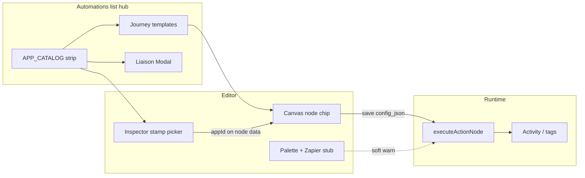

# Automations Apps v1 - Plan

## Goal Capsule

**Objective.** Let customers use Automations with the landing marquee apps through a clean, intuitive, beautiful product surface — destination stamps on the CRM spine, branded Activity trails, catalog + journey discovery, honest liaison readiness, and one Zapier stub — without shipping live API keys or OAuth yet.

**Product authority.** Desk CRM Automations list hub + editor; first-party trigger→action spine remains the runtime. Marquee apps: Notion, Slack, ChatGPT, Claude, Stripe, Zapier, Mailchimp, Google Calendar, Google Maps, Linear, Apple, Twilio, QuickBooks, HubSpot, Xero, GitHub.

**Open blockers.** None.

**Product Contract preservation.** Product Contract unchanged (R1–R10, KD1–KD5, SC1–SC4 preserved). Planning resolved deferred Q1–Q3 into KTDs below.

---

## Product Contract

### Summary

Ship Automations Apps v1 as a spine-stamps experience: CRM actions stay the only executable steps; apps appear as destinations, journeys, and liaison readiness across list and editor with light chrome and one visual language. Runtime writes branded CRM outcomes (Activity notes and existing CRM actions) until a later credentials plan upgrades delivery.

### Problem Frame

Marketing already names sixteen tools on the landing marquee, but Automations is CRM-only (palette Triggers → Actions → Logic → Templates; closed trigger/action kinds; no Apps catalog or connect model). Customers who expect Slack/Stripe-style automation find a blank promise. Building real connectors now would block the spine; shipping costume “Slack nodes” that don’t run would break trust. The gap is an honest, beautiful composition surface that teaches apps as destinations on Desk’s hub.

### Requirements

**Discovery (list hub)**

- R1. Automations list hub surfaces the sixteen marquee apps via an APP_CATALOG-driven strip or tiles and branded journey templates (e.g. form → Slack-ready note, deal → Stripe prep), not a Settings marketplace as the primary entry.
- R2. Journey templates still produce CRM-executable workflows (stamps optional on actions); unpaired apps (e.g. GitHub, Linear, Maps) may sit on a secondary rail without equal weight to spine-paired journeys.
- R3. List and editor share one visual language (icons, readiness chips, typography density) with light chrome — every v1 surface present, no heavy marketplace chrome.

**Editor (stamps & Zapier)**

- R4. First-party action nodes gain an optional destination stamp from APP_CATALOG (Slack, Notion, Stripe, …) in the inspector; stamps do not add sixteen new runnable node kinds.
- R5. When a stamped action runs, CRM behavior remains first-party: Log note / create activity uses a branded subject such as `[Slack] …`; tag updates still update contact tags; stamps do not invent fake external delivery.
- R6. Palette stays Triggers → Actions → Logic → Templates plus exactly one foreign stub: Zapier / webhook (soon) — dimmed, non-executing, inspector shows intended payload shape for a later adapter.
- R7. Visible UI matches actionable targets: stamps and Zapier stub never imply a live external send until credentials ship.

**Readiness (liaison)**

- R8. App readiness uses honest liaison language (Available on spine · Marked for connect · Live later) — no OAuth modal; CTA opens a sheet describing what the app will do, which CRM events it pairs with, and that credentials are a later plan (plus optional “notify me / mark for connect”).
- R9. Stripe’s liaison may point at existing Money / Payments framing rather than a blank Connect flow.

**Quality bar**

- R10. Customer-facing success is that Automations with apps feels clean, intuitive, and beautiful, and that intended destinations are understandable on Contact Activity / workflow UX — not that Slack or Stripe messages are delivered.

### Scope Boundaries

**In scope.** APP_CATALOG; list-hub journeys + app presence; inspector destination stamps; branded Activity (and honest CRM action) shadows; liaison readiness via shared Modal; Zapier stub with soft validation banner; shared light visual language; fix create-from-template trigger denormalization when touching Automations list.

**Deferred for later.** OAuth, API keys, live delivery; Zapier adapter execution; costume app nodes; Activity Feed as Connect Inbox; Settings as Apps home; org-persisted “mark for connect.”

**Outside this product's identity.** Replacing first-party Automations with a Zapier clone; requiring external SaaS before CRM workflows run.

**Deferred to Follow-Up Work.** Vitest / automated test harness for Automations (repo has no test runner today).

### Key Decisions

- KD1. Full v1 stack on both list and editor with light chrome (session-settled: user-directed — chosen over core-only or discovery-first: every surface present, minimal chrome, one visual language).
- KD2. Spine stamps approach (session-settled: user-directed — chosen over costume nodes and journeys-first: honest CRM-executable graphs; apps as destinations).
- KD3. Keys / OAuth / live API communication out of this plan (session-settled: user-directed — chosen over building connect plumbing now: separate credentials plan).
- KD4. Success bar is experiential trust and beauty, not external delivery (session-settled: user-approved — confirmed over a harder “message sent” metric for this wave).
- KD5. Prefer APP_CATALOG as a static registry feeding list, stamp picker, and liaison — planning owns file layout; product requires one source of truth for the sixteen apps.

### Success Criteria

- SC1. A customer opening Automations can see marquee apps and start an app-named journey without leaving the Automations tab.
- SC2. Building a workflow with a stamped action saves and runs as CRM today; Contact Activity (or equivalent) shows branded destination intent when the action writes a note/activity.
- SC3. No UI path implies successful OAuth or live Slack/Stripe send.
- SC4. Visual density matches “light chrome / one language” — list and editor feel like one product, not a bolted-on logo wall.

### Assumptions

- A1. Customers currently have no in-product path to marquee tools inside Automations; the landing marquee is the demand signal.
- A2. “Marked for connect” is UI/session-only for v1 (see KTD3).
- A3. AI apps (ChatGPT, Claude) are catalog/stamp peers in this wave, not a separate executable model integration.

### Dependencies

- Existing Automations list + React Flow editor (palette / canvas / inspector).
- Existing CRM actions and Activity writes; Forms FIELD_CATALOG / Settings “Mobile only” patterns as UX analogues.
- Automations POV: first-party spine now; Zapier later as adapter.
- Shared `Modal` component for liaison.

---

## Planning Contract

### Key Technical Decisions

- KTD1. Store destination as optional `appId` on `AutomationNodeData` (open index already allows it); do not extend `AutomationAction` / `AutomationTrigger` unions with sixteen app kinds (session-settled: user-directed — spine stamps over costume nodes).
- KTD2. Single static `APP_CATALOG` module mirroring Forms `fieldCatalog.ts` — fields: `id`, `label`, `formation` (ai | notify | money | sync | escape | later), `readiness` (available | liaison | paper), `spineHint`, `stampSubjectPrefix`, `liaisonBody`, optional `deepLinkHint` (e.g. Stripe → Money). Feeds list strip, stamp picker, liaison Modal, icons.
- KTD3. “Mark for connect” is session/UI-only (React state or `sessionStorage` keyed by org/app) — no PocketBase collection in v1 (session-settled: user-directed — chosen over org persistence now).
- KTD4. Zapier appears as a non-addable dimmed palette row that opens inspector/liaison-style payload preview; if a workflow somehow contains a Zapier placeholder node, `validateWorkflow` emits a soft warning banner (not a hard save block) and the runner no-ops that node (session-settled: user-directed — soft validation over silent-only).
- KTD5. Liaison CTA uses shared `Modal` / `FormModal` patterns from `components/Modal.tsx`, not a new sheet primitive (session-settled: user-directed — Modal over inspector-clone panel).
- KTD6. Branded subjects: when `appId` is set on `create_activity` / `notify`, prefix subject with `[Label] ` from catalog if the subject does not already start with `[`; tag actions keep tag mutation and may append a short Activity note with branded subject when useful — never call external APIs.
- KTD7. While editing Automations list create paths, set denormalized `trigger` from the workflow’s trigger node (fix createFromTemplate hardcoding `form_submitted`).

### High-Level Technical Design

Stamps ride on existing CRM action nodes. Catalog is read-only metadata. Liaison never starts OAuth.

### Assumptions (planning)

- No automated unit test runner in repo; verification is manual smoke + `validateWorkflow` banner checks.
- App icons may be simple monochrome marks in `AutomationIcons` if brand SVGs are unavailable — prefer consistent StepBadge-sized marks over mixed logo assets.

### Open Questions

- Q1 (deferred): Whether credentials plan should migrate session “marked” apps into org storage — out of v1.
- Q2 (deferred): Exact Zapier payload field list for the preview — refine when adapter plan starts.

---

## Implementation Units

### U1. APP_CATALOG registry and icons

**Goal:** Single source of truth for the sixteen marquee apps.
**Requirements:** R1, R3, R8, R9, KD5, KTD2
**Dependencies:** None
**Files:**
- Create: `src/components/automations/appCatalog.ts`
- Modify: `src/components/automations/AutomationIcons.tsx`
**Approach:** Define catalog types + `APP_CATALOG` array with formation/readiness/liaison copy; export helpers `appById`, `appsByFormation`. Add lightweight icon components or mapped marks per app id. Stripe entry includes Money deep-link hint.
**Patterns to follow:** `src/pages/forms/fieldCatalog.ts`, `src/lib/settings-hub.ts`
**Test expectation:** none — static data module; smoke via TypeScript compile
**Verification:** Catalog exports sixteen ids matching the marquee list; helpers resolve by id.

### U2. Stamp field + branded runtime subjects

**Goal:** Persist `appId` on actions and brand Activity subjects at runtime.
**Requirements:** R4, R5, R7, KTD1, KTD6
**Dependencies:** U1
**Files:**
- Modify: `src/lib/types.ts` (document `appId` on `AutomationNodeData`)
- Modify: `src/lib/platform-api.ts` (`executeActionNode`)
- Modify: `src/lib/automation-workflow.ts` (optional helper `brandedSubject`)
**Approach:** When executing `create_activity` / `notify`, if `data.appId` resolves in catalog, ensure subject uses `[Label] …` prefix. Do not invent external delivery. Tag actions unchanged for tag write; optional short branded Activity note only if already writing one.
**Patterns to follow:** Existing subject fallbacks in `executeActionNode`
**Execution note:** Prefer a small pure helper for prefixing so UI and runner share copy rules.
**Test scenarios:**
- Happy: stamped Log note with subject `Follow up` → Activity subject `[Slack] Follow up` (or equivalent label).
- Edge: subject already starts with `[` → do not double-prefix.
- Edge: unknown `appId` → run CRM action without brand prefix; no throw.
**Verification:** Manual run of a stamped automation after U3; Activity subject shows brand prefix.

### U3. Inspector stamp picker and canvas chip

**Goal:** Customers assign destinations on CRM actions; canvas shows a small stamp chip.
**Requirements:** R3, R4, R7, R10
**Dependencies:** U1, U2
**Files:**
- Modify: `src/components/automations/AutomationInspector.tsx`
- Modify: `src/components/automations/AutomationNodes.tsx`
**Approach:** On action nodes, add Destination select (None + catalog apps, grouped by formation). Clear copy that delivery is Activity/spine until Connect. Canvas action node shows compact chip when `appId` set.
**Patterns to follow:** Existing inspector selects; `StepBadge` / chip styling
**Test scenarios:**
- Happy: select Slack → node data `appId=slack` → chip visible → save persists in `config_json`.
- Happy: clear destination → chip gone.
**Verification:** Round-trip save/reload keeps stamp; UI does not say “sent to Slack.”

### U4. Zapier stub + soft validation banner

**Goal:** Honest long-tail escape hatch without a runnable peer app.
**Requirements:** R6, R7, KTD4
**Dependencies:** U1
**Files:**
- Modify: `src/components/automations/AutomationPalette.tsx`
- Modify: `src/components/automations/AutomationInspector.tsx` (or small Zapier preview panel)
- Modify: `src/lib/automation-workflow.ts` (`validateWorkflow`)
- Modify: `src/components/automations/AutomationCanvas.tsx` (surface soft issues)
- Modify: `src/lib/platform-api.ts` (no-op if placeholder kind ever present)
**Approach:** Dimmed palette row “Zapier / webhook (soon)” — click opens Modal or inspector preview of future payload (`contact_id`, trigger, stage, …), does not add a CRM action kind. Soft warning in validation when a reserved zapier placeholder is detected in workflow data (if used). Runner never calls Zapier.
**Patterns to follow:** Palette `disabled` opacity for structural unreadiness; canvas amber banner for issues
**Test scenarios:**
- Happy: click Zapier stub → Modal/preview with “credentials later”; graph unchanged.
- Soft warn: if placeholder present → banner text soft, save still allowed.
**Verification:** No path executes external Zapier; banner copy is non-blocking.

### U5. Journey templates + list-hub app strip

**Goal:** Discovery that teaches apps as destinations on CRM journeys.
**Requirements:** R1, R2, R3, SC1, KTD7
**Dependencies:** U1, U3 (stamps on template action nodes optional but preferred)
**Files:**
- Modify: `src/components/automations/templates.ts`
- Modify: `src/pages/automations/AutomationsPage.tsx`
**Approach:** Add 2–3 app-named journey templates (form→Slack-ready note, deal→Stripe prep, chat→Claude/Twilio-ready note) that emit CRM workflows with `appId` stamps. List hub: light APP_CATALOG strip/tiles (formation order) + secondary rail for later/unpaired apps; click opens liaison Modal (U6) or filters journeys. Fix `createFromTemplate` / blank create to set `trigger` from workflow trigger node.
**Patterns to follow:** Existing template cards + `FlowChipRow`; avoid Settings marketplace chrome
**Test scenarios:**
- Happy: create from deal journey → denormalized trigger is `deal_stage_changed`, not `form_submitted`.
- Happy: list shows sixteen apps without overwhelming the template grid.
**Verification:** SC1 manual walkthrough; deal/chat templates fire on correct events after enable.

### U6. Liaison Modal + session mark-for-connect

**Goal:** Honest readiness without OAuth.
**Requirements:** R8, R9, R10, KTD3, KTD5
**Dependencies:** U1
**Files:**
- Modify: `src/pages/automations/AutomationsPage.tsx` (and/or small `AppLiaisonModal.tsx`)
- Modify: `src/components/Modal.tsx` usage only (no new sheet system)
- Optional: tiny `src/components/automations/appConnectIntent.ts` for sessionStorage helpers
**Approach:** Modal shows app label, spine hint, liaison body, readiness chip, “Mark for connect” / “Credentials in a later plan.” Stripe mentions Money/Payments. Marked state is session-only; visual chip on catalog strip updates. Never fake OAuth.
**Patterns to follow:** Settings “Mobile only” honesty; `Modal` / `FormModal`
**Test scenarios:**
- Happy: open Slack liaison → mark → strip shows marked; refresh may clear (session) — document expected.
- Guard: no button labeled Connect that starts auth.
**Verification:** SC3; liaison copy matches R8/R9.

### U7. Shared visual language pass

**Goal:** List and editor feel like one composition.
**Requirements:** R3, R10, SC4
**Dependencies:** U1–U6
**Files:**
- Modify as needed: `AutomationsPage.tsx`, `AutomationPalette.tsx`, `AutomationInspector.tsx`, `AutomationIcons.tsx`, `AutomationNodes.tsx`
**Approach:** Align spacing, chip styles, readiness colors, empty/preview copy; keep chrome light. No new purple/glow marketing aesthetics — match Desk Automations tokens.
**Test expectation:** none — visual QA
**Verification:** Side-by-side list + editor screenshots against SC4.

---

## Verification Contract

**Automated:** `pnpm exec tsc --noEmit` must pass.

**Manual smoke (required):**
1. List hub shows catalog + new journey templates; create deal journey → correct trigger field.
2. Stamp an action → save → reload → chip remains; run automation → Activity subject branded.
3. Zapier stub opens preview; soft banner if applicable; no external call.
4. Liaison Modal + mark-for-connect session behavior; no OAuth.
5. Visual: light chrome, shared chips/icons across list and editor.

**Quality gates:** No new runnable app action kinds in unions; no credential fields stored.

---

## Definition of Done

- All units U1–U7 complete with Verification above green.
- Product Contract R1–R10 and SC1–SC4 satisfied.
- Session-settled KTDs (stamps, keys deferred, Modal liaison, soft Zapier warn, session mark) honored.
- Typecheck clean; no OAuth/key plumbing introduced.

---

## Risks & Dependencies

| Risk | Mitigation |
|------|------------|
| Fake-Connect trust break | Liaison language + R7; ban Connect CTA that implies auth |
| Template trigger bug regresses journeys | U5 explicit fix + smoke on deal/chat |
| Zapier stub mistaken for runnable | Dimmed row + soft warn + no union kind |
| Icon asset gaps | Monochrome marks in AutomationIcons |
| No automated tests | Manual smoke checklist in Verification Contract |

**Sources & research:** `docs/ideation/2026-07-26-automations-apps-integrations-ideation.html`; `docs/superpowers/specs/2026-07-25-automations-pov.md`; `docs/solutions/deals-board-teleport-fix.md` (visible=actionable); Forms `fieldCatalog.ts`; Settings Mobile-only pattern. External research skipped — local patterns sufficient.
