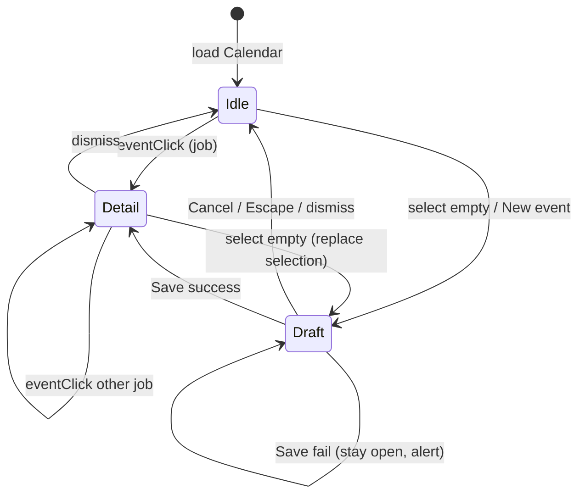

# feat: Google Calendar-style calendar panel interactions

## Goal Capsule

**Objective.** Make Calendar feel Google Calendar–like: click an event to open details on the right; hide that panel when nothing is selected; empty-slot / drag opens a draft create form in the right panel that only persists on Save.

**Product authority.** Session-settled UX decisions below; existing Calendar page owns jobs-as-events via FullCalendar.

**Open blockers.** None.

**Product Contract preservation.** Product Contract authored in this bootstrap (no upstream brainstorm).

---

## Product Contract

### Summary

Rework Calendar page selection and create flows so the right details panel mounts only when editing or drafting an event, empty-slot create is draft-then-Save, and click-existing opens details — matching Google Calendar interaction expectations while keeping Desk’s right-panel placement (not a floating popover).

### Problem Frame

Today, drag/click on empty time instantly calls `createEvent` (API + optimistic job), and the right “Task Details” column is always `w-72` even when idle. Users browsing the grid create accidental events and see a constant details chrome. Reference UX (Google Calendar create/edit; Notion Calendar right utility column) plus session research favors selection-driven details and draft-before-persist create, with details kept on the right per product choice.

### Requirements

- R1. Clicking an existing job event opens the right details panel for that event.
- R2. When nothing is selected (and no draft is active), the right details column is fully hidden so the calendar uses the full width.
- R3. Selecting an empty slot (click or drag-select) opens a draft create form in the right panel prefilled with the selected date/time range; no job is persisted until Save.
- R4. Saving a draft creates the job via the existing create path (client + package prerequisites), assigns default category metadata, and leaves the panel open on the persisted event.
- R5. Canceling or dismissing a draft (close control, Escape, or replacing with a new empty select) discards the draft with no API create.
- R6. Calendar toolbar “+ New event” opens the same draft-create path (defaulted to the current view anchor date), not instant API create.
- R7. Drag-move and resize of **persisted** events continue to update immediately (existing behavior).
- R8. Time-block (blocked) events stay non-editable; click still shows a toast, not the details panel.
- R9. Visible panel mode matches the interaction: idle (hidden) vs draft create vs existing-event details (visible = actionable; see `docs/solutions/deals-board-teleport-fix.md` principle).

### Scope Boundaries

**In scope.** `CalendarPage` selection model; conditional right panel; draft create from `select` and toolbar New; Save/Cancel for drafts; dismiss/clear selection; optional draft preview on the grid; reuse of existing form fields and create/update/delete APIs.

**Deferred for later.** Google-style left mini-month / calendar list; Keep/Tasks icon rail; floating event popover; redesign of auto-save-on-blur for **existing** event edits.

**Outside this product's identity.** Replacing FullCalendar; changing jobs/time-blocks domain model; live Google Calendar sync.

**Deferred to Follow-Up Work.** Align App header / Dashboard “New Event” (`useCreateActions.createEvent` with navigate) to draft-on-calendar; add Vitest (repo has no test runner today).

### Key Decisions

- KD1. Details stay on the right panel (session-settled: user-directed — chosen over Google’s floating event popover: matches Desk layout preference).
- KD2. Idle right panel fully collapses/hides (session-settled: user-directed — chosen over slim idle/utility pane).
- KD3. Empty-slot create is draft in right panel, persist on Save (session-settled: user-directed — chosen over instant-create-then-select).
- KD4. Calendar “+ New event” uses the same draft path as empty-slot create (planning default — chosen for consistency with KD3 on the Calendar surface; off-calendar create deferred).

### Success Criteria

- SC1. Idle calendar shows no right details column.
- SC2. Event click shows details; empty-slot select shows draft without a new job in the data list until Save.
- SC3. Cancel draft leaves jobs unchanged; Save adds one job and keeps the panel on that event.
- SC4. Drag/resize of existing events still persists; blocked slots unchanged.

### Actors

- A1. Desk user scheduling jobs on Calendar.

### Key Flows

- F1. View → click event → edit/details in right panel → dismiss → panel hides.
- F2. View → drag empty range → draft panel → edit fields → Save → persisted event selected.
- F3. View → drag empty range → draft → Cancel/Escape → no create, panel hides.
- F4. View → “+ New event” → draft at anchor date → Save or Cancel as in F2/F3.

### Acceptance Examples

- AE1. Covers F1 / R1–R2. With no selection, right column absent; click a job event; panel appears with that title; close/dismiss; panel gone.
- AE2. Covers F2 / R3–R4. Drag 10–11 AM Tuesday; panel opens as draft; jobs count unchanged; Save; one new job appears at that slot; panel shows persisted event.
- AE3. Covers F3 / R5. Open draft as in AE2; Cancel; jobs unchanged; panel hidden.
- AE4. Covers F4 / R6. Click “+ New event”; draft opens without API create until Save.

---

## Planning Contract

### Assumptions

- Off-calendar “New Event” (App menu, Dashboard) may keep instant `createEvent` + navigate until a follow-up; only Calendar-local create entry points must use draft-then-Save.
- Existing-event field edits may keep blur/change auto-save; explicit Save is required for **drafts**.
- After `unselect()`, keep the selected range visible via a **draft event in the FullCalendar `events` array** (not via lingering `selectMirror`). `selectMirror` only covers the drag gesture itself.

### Key Technical Decisions

- KTD1. Panel visibility = `selected !== null` (including draft), mounted conditionally like `AutomationCanvas`’s inspector — not a zero-content `w-72` placeholder. (session-settled: user-directed — chosen over slim idle pane: KD2). Conditional mount wraps the **entire** right column (header + form + “This period”), never only the form.
- KTD2. Introduce an explicit panel mode (`idle` | `draft` | `detail`) or equivalent draft flag on selection so Save/Cancel and API calls branch cleanly; do not reuse `temp-*` optimistic IDs from `createEvent` for drafts (those still hit the API). Build drafts with `buildDraftCalEvent()` that includes a synthetic `DeskJob` (`id: draft-…`) held only in React state so existing panel fields can bind to `selected.job.*`.
- KTD3. `onDateSelect` builds a local draft and opens the panel; call `api.createJob` (or a shared persist helper extracted from `createEvent` without the optimistic `temp-*` path) only from draft Save. Destructure `clients` / `packages` from `useData` (or the helper) for the Save gate. Keep `useCreateActions.createEvent` for off-calendar callers until follow-up.
- KTD4. Dismiss paths for this plan: labeled header close **and** `PanelEdgeToggle`, Escape, and new empty-select replacing a draft — discard unsaved draft without confirm. Click-away on empty grid is deferred (FullCalendar has no reliable universal click-away); do not block ship on it.
- KTD5. Prefer extracting the right column into `src/components/calendar/EventDetailPanel.tsx` if the page stays hard to reason about after mode branching; acceptable to keep inline if the diff stays readable.

### High-Level Technical Design

Panel and create lifecycle:

Interaction vs persistence:

| User action | Panel | API |
|---|---|---|
| Click job event | Detail | none (open) |
| Select empty / New | Draft | none until Save |
| Save draft | Detail | `createJob` |
| Cancel draft | Idle | none |
| Drag/resize job | Detail or Idle | `updateJob` (existing) |

### Risks & Dependencies

- Risk: Accidental discard of a filled draft on Escape/new select — mitigated by Google-like expectation; optional toast “Draft discarded” if needed during impl.
- Risk: Draft preview looks like a real event — use distinct styling / non-editable draft id prefix (`draft-`) and block drag handlers for drafts.
- Dependency: `createJob` still requires client + package; surface existing alert on Save, not on opening the draft.
- Constraint: No automated test runner in `package.json` — verification is build + manual smoke (same as Automations plans).

### Open Questions

- Q1 (deferred). Should App / Dashboard “New Event” navigate into Calendar with a pre-opened draft? Follow-up work.
- Q2 (deferred). Should existing-event edits also require explicit Save? Out of scope unless product revisits.
- Q3 (deferred / review). In detail mode, demote or remove redundant “Save Task” given auto-save-on-blur (visible=actionable)? Default: keep current Save button unless accepted in review walkthrough.
- Q4 (deferred / review). Require toast / `aria-live` when discarding an edited draft? Default: optional lightweight toast during impl.

---

## Implementation Units

### U1. Selection model and hideable panel shell

**Goal.** Drive right-panel mount from selection/draft state; idle calendar is full-bleed.

**Requirements.** R1, R2, R7, R8, R9

**Dependencies.** None

**Files.**
- Modify: `src/pages/CalendarPage.tsx`
- Reuse: `src/components/automations/PanelEdgeToggle.tsx`

**Approach.**
1. Replace always-on `w-72` column with conditional render of the **full** right shell (header + form area + “This period”) when selection/draft is active.
2. Keep `onEventClick` → select job for detail mode; ignore/toast blocks (accessible toast / live region, not silent).
3. Dismiss: header close (`aria-label="Close event panel"`) **and** `PanelEdgeToggle`, plus Escape; clear selection. Focus first field or panel heading on open; restore focus to calendar/event on dismiss.
4. Preserve `fc-event-selected` / ARIA wiring for the selected job id when in detail mode; wrap panel in `<aside>` with mode-specific `aria-label`.
5. Leave `eventDrop` / `eventResize` / `persistEventTimes` for persisted jobs unchanged (R7 regression guard).

**Patterns to follow.** `AutomationCanvas` conditional inspector mount; `AutomationInspector` dual close controls; existing Calendar form field layout when open.

**Test scenarios.**
- Covers AE1. Idle: right column not in layout; event click mounts panel with that event; dismiss unmounts panel.
- Clicking a time-block does not open the panel (toast / live announcement only).
- Covers SC4 / R7. Drag-move and resize of a persisted job still call `updateJob`.

**Verification.** Manual: week view idle vs selected; Escape/close hides panel; drag/resize still persists. `pnpm build` still passes.

---

### U2. Draft create from empty select and toolbar New

**Goal.** Empty-slot / drag and “+ New event” open draft forms without API create until Save.

**Requirements.** R3, R4, R5, R6, R9

**Dependencies.** U1

**Files.**
- Modify: `src/pages/CalendarPage.tsx`
- Modify: `src/hooks/useCreateActions.ts` only if extracting a shared “build draft defaults” helper; prefer not changing off-calendar `createEvent` behavior
- Modify: `src/lib/calendar-categories.ts` only if remapping draft id → real id on Save needs a helper
- Touch: `src/lib/api.ts` only via existing `createJob` from Save

**Approach.**
1. Add `buildDraftCalEvent(arg | anchor)` that returns a `CalEvent` with synthetic `DeskJob` (`draft-${timestamp}`), mirroring optimistic field defaults from `createEvent` but **without** `setJobs` / API. Open panel in draft mode; call `unselect()`; immediately include a non-persisted FC draft event in `events` so the range stays visible (dashed/hatch styling, “(Draft)” title or tooltip, `aria-label` “Draft event, not saved”, non-editable).
2. Change toolbar “+ New event” to the same draft builder using `anchorDate` (sensible default time if needed).
3. Draft Save: prefer a small helper extracted from `createEvent` (validate `clients`/`packages`, `createJob`, hydrate) **without** optimistic `temp-*`; apply category/color from draft state onto the **real** id after create; switch to detail on the new job.
4. In draft mode, field handlers update local draft state only — never `saveSelected` / `updateJob`. Detail mode keeps existing auto-save wiring.
5. Draft Cancel/dismiss: drop draft + draft FC event; ensure no job left in `jobs`.
6. Introduce `isEphemeralEventId` (`temp-` | `draft-`) and replace `startsWith('temp-')` guards at category/color/delete/`persistEventTimes`/Save/Delete-key sites; suppress window Delete/Backspace when focus is in panel inputs or mode is draft.

**Execution note.** Prefer install/runtime smoke verification over unit coverage (no Vitest in repo).

**Patterns to follow.** Existing panel fields and `saveSelected` / `deleteSelected` for detail mode; `createEvent` in `useCreateActions.ts` as the payload checklist — Calendar select must not call it.

**Test scenarios.**
- Covers AE2. Drag a timed range → draft panel → jobs length unchanged → Save → one new job at that range → panel in detail.
- Covers AE3. Open draft → Cancel → jobs unchanged → panel hidden.
- Covers AE4. “+ New event” opens draft without create until Save.
- Save with no clients/packages shows the existing cannot-create alert and leaves the draft open.
- Starting a new empty select while a draft is open replaces/discards the previous draft without creating.
- Typing in draft fields does not call `updateJob`; category picks on draft do not write `draft-*` keys to localStorage until Save.

**Verification.** Manual AE2–AE4; confirm Network/API has no create on select; create only on Save. `pnpm build`.

---

### U3. Polish dismiss affordances and draft/detail chrome

**Goal.** Make draft vs detail visually clear and easy to dismiss without changing create/persist rules.

**Requirements.** R2, R5, R9

**Dependencies.** U1, U2

**Files.**
- Modify: `src/pages/CalendarPage.tsx`
- Optionally create: `src/components/calendar/EventDetailPanel.tsx` (extract if U1–U2 leave the page unwieldy)

**Approach.**
1. Header + helper copy by mode: draft → “New event” / “Unsaved — Save to add to calendar”; detail → “Task Details” / drag-resize-Delete guidance (no Delete copy on drafts).
2. Draft primary actions: Save + Cancel. Detail: keep Delete; keep or demote “Save Task” per open review item (auto-save fields unchanged for detail unless that item is accepted).
3. “This period” renders only inside the open panel shell; never when idle (KD2).
4. Light width transition optional; not required.

**Patterns to follow.** Inspector close patterns in Automations; existing Calendar styling tokens (`colors.green`).

**Test scenarios.**
- Draft header/actions differ from detail; Cancel labeled and works.
- Idle layout has no residual right border strip or “This period” column.

**Verification.** Visual pass in week + day views; Escape and close both idle the page.

---

## Verification Contract

- **Build gate.** `pnpm build` succeeds after changes.
- **Manual smoke (required).** Walk AE1–AE4 on week view; spot-check day view select; confirm drag/resize still updates an existing event; blocked slot click still toasts only.
- **Automated tests.** None in-repo today — do not block on adding Vitest in this plan.

## Definition of Done

- All of R1–R9 satisfied on Calendar page; KD1–KD4 honored (KD4 verified via R6 / AE4).
- U1–U3 complete with Verification outcomes above.
- Off-calendar create left unchanged or explicitly noted if touched; follow-up called out for App/Dashboard draft alignment.
- No regression to Money / Contacts / Deals navigation or unrelated pages.

---

## Sources & Research

- Local: `src/pages/CalendarPage.tsx`, `src/hooks/useCreateActions.ts`, `src/components/automations/AutomationCanvas.tsx`, `src/components/automations/PanelEdgeToggle.tsx`
- Institutional: `docs/solutions/deals-board-teleport-fix.md` (visible = actionable)
- Prior session UX: Google Calendar create/edit help; Eleken calendar UX (side panel over always-on clutter); Mobiscroll create-then-edit-dialog pattern
- Platform: Calendar is a protected core surface (`docs/superpowers/specs/2026-07-25-crm-platform-waves-design.md`)
