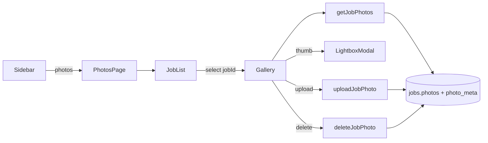

# Desk Photos - Plan

## Goal Capsule

**Objective.** Add a Desk Photos surface in the sidebar so an operator can pick a job, browse its before/after gallery, upload missing shots the same day, and delete mistaken shots (mobile parity).

**Product authority.** Product Contract from `ce-brainstorm`; Key Decisions KD1–KD5 are session-settled. This contract owns Photos only — Sunday control tower is not active scope.

**Open blockers.** None.

**Product Contract preservation.** Restructured, no scope change: damage-type filter deferred to follow-up (mobile `PhotoType` is `before` | `after` only). Core before/after filters + upload + delete intent unchanged.

---

## Product Contract

### Summary

Ship Photos as its own sidebar destination (not a Home tab). Land on a job picker, then a master–detail gallery with before/after filters, lightbox viewing, Desk upload, and delete on the selected job. Mobile remains the primary field-capture path; Desk upload fills gaps. Sunday Tower work stays deferred — Dashboard sales overview stays as-is for this round.

### Problem Frame

Owners review and complete paperwork on Desk. Job photos still live mainly on mobile capture. Without a Desk gallery + upload path, missing before/after shots force a phone round-trip.

### Actors

- A1. Owner / office operator on Desk (primary).
- A2. Field tech on mobile (captures most photos; not redesigning their flow here).

### Requirements

- R1. Photos appears as a top-level sidebar item separate from Dashboard, Money, and Calendar.
- R2. Landing selects a job first (search/list by client, date, or job label), then shows that job’s gallery.
- R3. Gallery supports type filters for before and after (and an All view), matching mobile `PhotoType`.
- R4. Operator can open a lightbox/detail view for any shot with readable PB file URLs under the current auth session.
- R5. Operator can upload one or more images from Desk onto the selected job, subject to the same type and size limits mobile already enforces — do not invent a separate vault policy.
- R6. Empty states: no jobs; search with zero matches; job with no photos; active filter matches none (but job has other types); and upload failure — each must be understandable and recoverable without leaving Photos.
- R7. Success bar: find any job’s before/after in under about one minute; add missing shots same day from Desk.
- R8. Operator can delete a photo from the selected job (parity with mobile delete), with confirm.

### Key Flows

- F1. Sidebar → Photos → search/pick job → filter type → browse thumbs → open lightbox.
- F2. With job selected → Upload → choose type → files attach to that job → gallery refreshes.
- F3. From gallery, operator can navigate to related Money/Calendar context only if already reachable elsewhere — Photos does not invent new invoice/send gates.
- F4. Delete photo → confirm → removed from `photos` + `photo_meta` → gallery refreshes.

### Acceptance Examples

- AE1. Covers R2, R3, R7. Operator searches “Lopez”, selects today’s full-detail job, filters After, sees thumbs within one minute of opening Photos.
- AE2. Covers R5, R7. Operator uploads two After shots for that job from Desk; they appear in the gallery and are visible on mobile for the same job after refresh.
- AE3. Covers R4. Operator opens a thumb; lightbox shows a full image loaded via auth’d PB URL.
- AE4. Covers R6. Operator selects a job with zero photos; UI shows empty gallery plus clear Upload CTA (not a blank dead end).
- AE5. Covers R8. Operator deletes one After shot; it disappears on Desk and on mobile refresh.

### Key Decisions

- KD1. Photos is a sidebar destination, not a Dashboard / Home tab. `(session-settled: user-directed — chosen over Home tabs including Photos: keep Dashboard clean; Photos is its own place)`
- KD2. Organization is job-first master–detail (shape A), not an org-wide photo feed or expandable cards. `(session-settled: user-approved — chosen over feed and fullscreen-only gallery)`
- KD3. v1 includes Desk upload, not view-only. `(session-settled: user-directed — chosen over view-only: same-day fill-in from office)`
- KD4. Sunday control tower / Dashboard health queues are deferred; do not build them in this work unit. `(session-settled: user-directed — chosen over continuing Tower: focus Photos first)`
- KD5. Stack posture: PocketBase file fields + existing React / Tailwind / Modal patterns; optional tiny lightbox allowed if first-party Modal proves weak — no new UI framework. `(session-settled: user-approved)`

### Scope Boundaries

**In scope**

- Sidebar Photos page, job picker, before/after filters, lightbox, Desk upload/delete to selected job.
- Settings / workspace map honesty if a Photos row exists as Mobile-only.

**Out of scope / deferred**

- Sunday control tower on Dashboard.
- Damage-type filter (mobile has no `damage` PhotoType; inspection damage may live elsewhere).
- Replacing mobile as primary capture device.
- SMS, PDF/portal gates, Team roster, Inventory, Offline queue.
- Batch editing, AI tagging, client-facing albums.
- Adding Vitest to the repo (same constraint as prior Desk plans).

### Outstanding Questions

**Deferred to Planning (resolved below in KTDs)**

- PocketBase field names: `jobs.photos` + `jobs.photo_meta` (confirmed via mobile).
- Upload: multi-file `<input type="file" multiple accept="image/*">`; drag-drop optional polish, not required.
- Lightbox: start with first-party Modal; add dep only if needed.

**Resolve Before Planning**

- (none)

<!-- ce-section: work-relationships -->
### How This Work Fits Together

- **Current focus:** Desk Photos (sidebar browse + upload).
- **Deferred sibling:** Sunday control tower — brainstormed then paused; not requirements here.
- **Context:** Mobile field capture and shared PB `organization_id` remain system of record.

---

## Planning Contract

### Assumptions

- Fly PocketBase `jobs` collection already has multi-file `photos` and JSON `photo_meta` as mobile expects.
- Desk auth token can call `pb.files.getURL` / `getToken` the same way mobile does.
- Job list for picker can reuse `listJobs` (+ client expand already used on Desk).

### Key Technical Decisions

- KTD1. Port mobile photo contract into Desk helpers: `PhotoType = 'before' | 'after'`, `PhotoMeta`, `MAX_JOB_PHOTOS_PER_TYPE = 6`, plus mobile file size / edge / JPEG quality constants from `@rinse/core` / `job-photo-limits` (local copies — Desk is outside monorepo; do not import `@rinse/core` yet). Before `photos+`, run a browser compress step ported from Detailing `compress-job-photo` (or equivalent). Limit messaging mirrors mobile. Governs R3, R5.
- KTD2. API surface in `src/lib/api.ts` (or `src/lib/job-photos-api.ts` if `api.ts` is too large): `getJobPhotos`, `uploadJobPhoto` (browser `FormData` + `photos+` then patch `photo_meta`), `deleteJobPhoto` (`FormData` `photos-` update first, then `photo_meta` filter patch — match mobile `deleteJobPhoto`). Match mobile `invoices-api.ts` online path. Governs R4, R5, R8.
- KTD3. UI: new `PageId` `'photos'`, Sidebar item, `App.tsx` route to `PhotosPage` master–detail (job list left, gallery right). Reuse `Header`, existing search input patterns from Contacts/Calendar. Governs R1, R2, KD2.
- KTD4. Lightbox: create `PhotoLightbox` wrapping existing `Modal` with an image/wide variant (~90vw, minimal chrome). Add a lightbox package only if focus/Escape still fails. Governs R4, KD5.
- KTD5. Upload type: when Before/After filter is active, use that type; when All is active, require an explicit Before/After control before the file picker opens. Enforce count + size limits before upload; surface mobile-equivalent error copy. Governs R5, F2.
- KTD6. No new Vitest in this plan — verification is `pnpm build` + manual smoke (same as Calendar/Automations plans). Feature-bearing scenarios stay as manual checks / future-runner notes only (do not create `.test.ts` files in this work).
- KTD7. Protected files: whenever a job has photo filenames, call `pb.files.getToken()` (catch → undefined) and pass `{ token }` into `pb.files.getURL` for every thumb/lightbox URL — same as mobile `getJobPhotos`. UI must not use bare unprotected URLs. Governs R4.

### High-Level Technical Design

Upload sequence (directional):

1. `getOne(job)` → count `photo_meta` for type → reject if at limit.
2. `FormData` append `photos+` with `File` → `collection('jobs').update(id, formData)`.
3. Diff filenames → append `{ filename, type }` to `photo_meta` → second update.
4. Re-fetch / return `JobPhoto` with tokenized URL.

### Risks & Dependencies

- Risk: Protected file rules without token fail in `` — mitigate with `files.getToken()` like mobile.
- Risk: Meta drift if upload succeeds but meta update fails — re-fetch and surface error; do not leave silent orphans when avoidable (match mobile’s two-step).
- Dependency: Org-scoped jobs API rules already applied on Desk session.
- Constraint: No automated test runner in `package.json`.

### Open Questions

- Q1 (deferred). When should Damage / inspection photos appear on Desk? Separate surface later.
- Q2 (deferred). Wire Photos completeness into invoice/portal send gates when Wave 4 API client lands.
- Q3 (from 2026-08-02 review). Multi-file upload error strategy: stop on first failure vs continue-all then summary with per-file retry?
- Q4 (from 2026-08-02 review). When should Money/Calendar open Photos with that job preselected?
- Q5 (from 2026-08-02 review). How far to take gallery a11y beyond Escape/close (filter radiogroup, thumb arrow keys)?
- Q6 (from 2026-08-02 review). Delete affordance: grid action, lightbox toolbar, or both (mirror mobile)?

---

## Implementation Units

### U1. Job photo domain helpers and API

**Goal.** Desk can list, upload, and delete job photos with mobile-compatible meta and limits.

**Requirements.** R3, R4, R5, R8

**Dependencies.** None

**Files.**
- Create: `src/lib/job-photos.ts` (types, limits, size/compress helpers, limit message, merge filenames+meta → `JobPhoto[]`)
- Create or modify: `src/lib/job-photos-api.ts` and/or `src/lib/api.ts` (get / upload / delete)

**Approach.**
1. Define `PhotoType`, `PhotoMeta`, `JobPhoto`, `MAX_JOB_PHOTOS_PER_TYPE = 6`, size/edge/quality constants, `jobPhotoLimitMessage`.
2. Implement `buildJobPhotos(record)`: when `filenames.length > 0`, call `pb.files.getToken()` (catch → undefined) and pass `{ token }` into every `pb.files.getURL` (KTD7).
3. Implement `getJobPhotos(jobId)`, `uploadJobPhoto(jobId, file, type)`, `deleteJobPhoto(jobId, filename)` mirroring mobile’s online path (`photos+` / `photos-`).
4. Prefer browser `File` + `FormData` (no Expo `FileSystem`); compress each `File` to job-photo limits before append.
5. Delete order: `FormData` `photos-` first, then `photo_meta` filter patch (KTD2).

**Patterns to follow.** Mobile `apps/mobile/src/lib/invoices-api.ts` (`getJobPhotos` / `uploadJobPhoto` / `deleteJobPhoto`); Desk `src/lib/api.ts` org-scoped PB client usage.

**Execution note.** Prefer smoke verification of upload round-trip against Fly PB; pure meta/limit helpers are unit-testable later if a runner lands (KTD6 — no `.test.ts` in this unit).

**Test scenarios.**
- Happy: filenames + meta build photos with correct types; missing meta entry defaults type to `after` (mobile behavior).
- Edge: type count at 6 → upload throws limit message; oversized file rejected/compressed per mobile limits.
- Error: upload returns no new filename → clear error, no meta append.
- Integration: delete removes filename from meta and issues `photos-` first.
- Protected: thumbs use tokenized URLs when token available.

**Verification.** Helpers compile; manual API smoke via temporary page or console not required if U3–U4 cover UI — at minimum `pnpm build` after wiring.

---

### U2. Photos nav + page shell with job picker

**Goal.** Sidebar Photos opens a master–detail shell; left pane lists/searchable jobs.

**Requirements.** R1, R2, R6, R7

**Dependencies.** U1 (may stub gallery until U3)

**Files.**
- Modify: `src/lib/types.ts` (`PageId` += `'photos'`)
- Modify: `src/App.tsx` (nav item + page switch)
- Modify: `src/components/NavIcons.tsx` (new `IconPhotos`)
- Create: `src/pages/PhotosPage.tsx`
- Modify: any workspace map / settings hub row that labels Photos Mobile-only (if present)

**Approach.**
1. Add Photos nav entry near Calendar/Contacts with consistent icon style (`IconPhotos` in `NavIcons.tsx`).
2. Load jobs via `listJobs` (or lighter list); search filters by client name / date / package / notes.
3. Selecting a job sets `selectedJobId`; empty selection shows “Pick a job” placeholder on the right.
4. Empty org jobs → dedicated empty state (R6).
5. Search with loaded jobs but zero matches → “No jobs match your search” + clear-search (distinct from org-empty).
6. If Settings/workspace map labels Photos Mobile-only, flip to Open / honest when the page ships (in-scope honesty).

**Patterns to follow.** `Contacts` search list; `CalendarPage` header layout; Sidebar `NavItem` definitions in `App.tsx`.

**Test scenarios.**
- Covers AE1 (nav). Photos appears as sidebar destination; navigating mounts Photos page.
- Search narrows job list; selecting a row highlights it and targets gallery pane.
- Covers AE4 (partial). Zero jobs → empty state, no crash.
- Search no-match → clear-search empty state, not crash.

**Verification.** Manual: open Photos from sidebar; search and select; `pnpm build`.

---

### U3. Gallery grid, filters, lightbox

**Goal.** Selected job shows filtered thumbs; click opens Modal lightbox.

**Requirements.** R3, R4, R6, R7

**Dependencies.** U1, U2

**Files.**
- Modify: `src/pages/PhotosPage.tsx`
- Modify: `src/components/Modal.tsx` only if needed for wide/image variant props
- Create: `src/components/photos/PhotoLightbox.tsx`

**Approach.**
1. On job select, call `getJobPhotos`; show loading/error/empty with Upload CTA (empty).
2. Filter chips: All | Before | After; badge counts optional.
3. Thumb grid; click → `PhotoLightbox` (wide Modal) with full `url` image; Escape/close restores focus to thumb.
4. Consume only tokenized URLs from U1 (KTD7).
5. Lightbox: loading spinner while `img` loads; on error show recoverable “Could not load photo” + Close/Retry.
6. Filter-empty: job has photos but active Before/After filter matches none → distinct copy (“No before photos…”) + Upload CTA typed to that filter — not the zero-photo empty (R6).

**Patterns to follow.** Mobile `jobs/[id]/photos.tsx` filter model; Desk `Modal` for overlays.

**Test scenarios.**
- Covers AE1. After filter shows only after-typed shots.
- Covers AE3. Thumb opens lightbox with loaded image.
- Covers AE4. Zero photos → empty + Upload CTA.
- Filter-empty distinct from zero-photo.
- Lightbox load failure is recoverable.

**Verification.** Manual against a job with mixed before/after; `pnpm build`.

---

### U4. Upload and delete from Desk

**Goal.** Operator can add and remove shots for the selected job under mobile limits.

**Requirements.** R5, R6, R7, R8; F2, F4

**Dependencies.** U1, U3

**Files.**
- Modify: `src/pages/PhotosPage.tsx`
- Touch: `src/lib/job-photos-api.ts` / `api.ts`

**Approach.**
1. Upload control: multi-file input; type = active Before/After chip; when All is active, require Before/After control before opening the file picker (KTD5).
2. While uploading: disable Upload and type controls; show aggregate (or per-file) progress; block job switch until batch finishes or user cancels.
3. Sequential upload per file; error strategy deferred to Open Question Q3 — until then continue-on-error with end-of-batch summary (safer for same-day fill-in).
4. Delete: confirm → `deleteJobPhoto` → refresh list; if lightbox was open on that thumb, close it.
5. Refresh gallery after successful mutations.

**Patterns to follow.** Mobile upload + delete UX intent; Desk alert/toast conventions used on Money/Calendar.

**Test scenarios.**
- Covers AE2. Upload two After files → both appear; type meta persists.
- Limit: seventh After photo surfaces limit message; gallery unchanged for that file.
- Covers AE5. Delete removes shot from grid.
- Error: failed network leaves recoverable message without leaving page.
- In-progress: second Upload click ignored while batch runs.
- All filter: cannot start file picker until type chosen.

**Verification.** Manual Desk upload → mobile refresh sees files; delete round-trip; `pnpm build`.

---

## Verification Contract

- `pnpm build` succeeds after units land.
- Manual smoke checklist: AE1–AE5 against Fly PB org with real jobs.
- No Vitest gate in this plan (KTD6); no new `.test.ts` files in this work.

## Definition of Done

- Photos is a first-class sidebar page with job-first browse, before/after filters, lightbox, upload, and delete.
- Shared PB photo contract matches mobile enough that Desk uploads show on mobile and vice versa.
- Tower and Damage filter remain deferred, not partially stubbed as fake UI.
- Workspace/settings honesty updated if Photos was labeled Mobile-only.

## Appendix

### Mobile references (outside Desk repo)

- `Detailing/apps/mobile/src/lib/invoices-api.ts` — get/upload/delete photos
- `Detailing/apps/mobile/app/(tabs)/jobs/[id]/photos.tsx` — gallery UX
- `Detailing/packages/core/src/types.ts` — `PhotoType`, `PhotoMeta`
- `Detailing/packages/core/src/job-photo-limits.ts` — max 6 per type

### Research notes

Prior ops-reviewer research reinforced desk browse/governance vs field capture — aligns with Desk upload as fill-in, not camera replacement.
