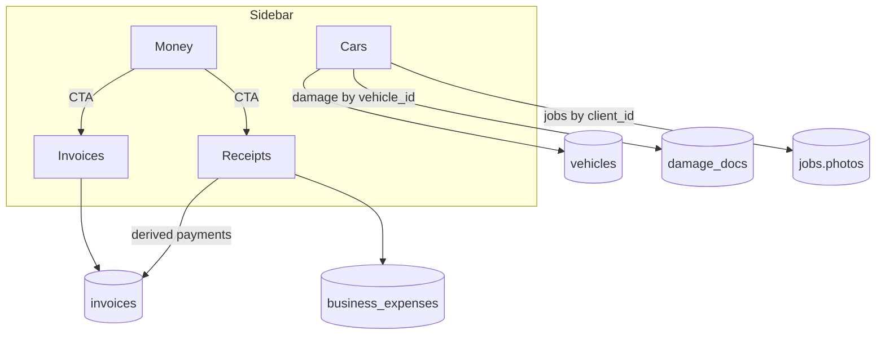

# Invoices, Receipts, and Cars tabs - Plan

## Goal Capsule

**Objective.** Add dedicated Desk sidebar destinations for Invoices, Receipts, and Cars that read/write the same PocketBase org collections mobile already uses, keep Money as the KPI overview hub, and fold the shipped Photos gallery into Cars.

**Product authority.** Product Contract below (ce-plan bootstrap). Session-settled nav and scope choices govern Requirements.

**Open blockers.** None.

**Product Contract preservation.** N/A (bootstrap — no upstream requirements-only artifact).

---

## Product Contract

### Summary

Ship three top-level tabs — Invoices, Receipts, Cars — beside existing Money. Money stays a slim overview (KPIs + chart) that deep-links into the new lists. Receipts covers business expenses and customer payment receipts derived from paid/partial invoices. Cars is a vehicle directory with detail pages that include vehicle fields, vehicle-linked damage docs, and before/after job photos for that vehicle’s client (accepting multi-vehicle ambiguity). Standalone Photos nav is removed; gallery upload/delete survives under Cars.

### Problem Frame

Operators already manage invoices and expenses from Money’s mixed feed, and browse job photos from a separate Photos tab. Vehicles exist in PocketBase and show only as counts on Contacts. They need dedicated Desk places that match how they think about paperwork and cars — without inventing new collections or a PDF/portal stack.

### Actors

- A1. Owner / office operator on Desk (primary).
- A2. Field tech on mobile (system of record for capture; Desk reviews and light-edits).

### Requirements

- R1. Sidebar includes top-level **Invoices**, **Receipts**, and **Cars**; **Money** remains; **Photos** is removed as its own nav item.
- R2. Invoices lists org `invoices` with search/status filters and light edit of status, total, amount paid, and tip (existing `updateInvoice` behavior) — no create/send/PDF/portal.
- R3. Receipts shows **business expenses** (`business_expenses`) with list / create / edit, and **payment receipts** derived from invoices where status is paid or `amount_paid > 0`.
- R4. Expense rows map mobile field honesty (`name`, optional `vendor`, optional `receipt_url` when present) so mobile-created expenses are not mislabeled; receipt images are view-only (no OCR/upload this round).
- R5. Cars lands on a vehicle directory from `vehicles`, then a detail view with vehicle fields + client link.
- R6. Under Cars detail: show damage docs for that `vehicle_id`, plus before/after galleries from jobs belonging to the same `client_id` (multi-vehicle clients may share job photos — disclosed in UI copy).
- R7. Job photo browse/upload/delete from the shipped Photos work remains available under Cars (pick a related job, then reuse existing photo helpers).
- R8. Money is slimmed to KPIs + chart (+ short optional preview) with CTAs that navigate to Invoices / Receipts; global header invoice search and invoice attention notifications point at Invoices, not the old mixed Money list.
- R9. Same PB org / same collections — never a desk-only shadow store for invoices, expenses, vehicles, or photos.
- R10. Success bar: find any invoice, expense, payment receipt, or vehicle details (with linked proof) in under about a minute from the sidebar.

### Key Flows

- F1. Sidebar → Invoices → filter/search → open or light-edit invoice → list reflects update.
- F2. Sidebar → Receipts → toggle/filter Expenses vs Payments → log or edit expense → see payment row for a paid/partial invoice.
- F3. Sidebar → Cars → search vehicles → open car → see details, vehicle damage docs, and client-job before/after → optionally upload/delete on a chosen job.
- F4. Money KPI / Money AR widget / global header invoice search → lands on Invoices (or Receipts for expense CTAs).

### Acceptance Examples

- AE1. Covers R1, R2, R10. Operator opens Invoices, finds an overdue invoice by number, updates status to paid; Money AR / paid KPI move accordingly after refresh.
- AE2. Covers R3, R4. A mobile-logged expense with a receipt image appears under Receipts with the correct name; thumbnail opens in lightbox when `receipt_url` exists.
- AE3. Covers R3. A paid (or partially paid) invoice appears under Receipts → Payments with amount paid and date.
- AE4. Covers R5, R6, R7. Operator opens Cars, selects a vehicle, sees make/model/plate and at least damage or job photos when those records exist for that vehicle/client.
- AE5. Covers R8. From Money, tapping unpaid AR navigates to Invoices (not a mixed expense feed).
- AE6. Covers R1, R7. Photos is gone from the sidebar; photo upload still works from Cars for a client job.

### Key Decisions

- KD1. Top-level Invoices + Receipts + Cars (Cars not nested under Receipts). `(session-settled: user-directed — chosen over nesting Cars inside Receipts)`
- KD2. Keep Money as overview sibling beside the new tabs. `(session-settled: user-directed — chosen over replacing/renaming Money)`
- KD3. Receipts = business expenses + payment receipts. `(session-settled: user-directed — chosen over expenses-only)`
- KD4. Merge Photos into Cars; remove standalone Photos sidebar item. `(session-settled: user-directed — chosen over keeping Photos nav)`
- KD5. Cars photo join = vehicle damage by `vehicle_id` + client-job before/after fallback. `(session-settled: user-directed — chosen over requiring job.vehicle_id or keeping Photos separate)`
- KD6. Expense receipt media = metadata / view existing image only. `(session-settled: user-directed — chosen over OCR or attach parity)`
- KD7. Slim Money to KPIs + chart with deep-links into Invoices / Receipts. `(session-settled: user-directed — chosen over keeping the full overlapping transaction list)`

### Scope Boundaries

**In scope**

- New pages + `PageId` / sidebar wiring; expense mapper honesty; derived payment receipts; vehicle directory + detail; Photos gallery relocated under Cars; Money slim + deep-link retargets; Settings / create-action deep links that currently point at Money for expenses.

**Out of scope / deferred**

- PDF generation, customer portal links, send gates (`apps/api` Wave 4).
- Invoice create / Stripe send / finalize immutability workflows beyond existing status/amount light edit.
- Receipt OCR, expense receipt upload from Desk.
- Enforcing `jobs.vehicle_id` / `inspection_vehicle_id` mapping as a hard join (optional later tightening).
- Full vehicle edit/delete API if not needed for directory + create; rich inventory of inspection schemas.
- Vitest / new test runner (same constraint as prior Desk plans).
- Sunday control tower / ops dashboard redesign.

### Deferred to Follow-Up Work

- Wire photo completeness into invoice/portal gates when Wave 4 API client lands.
- Optional `mapJob` of `inspection_vehicle_id` for tighter Cars photo association.
- Pagination beyond the existing 500-row org list caps.

<!-- ce-section: work-relationships -->
### How This Work Fits Together

- **Current focus:** Money-adjacent list surfaces + Cars directory absorbing Photos.
- **Supersedes:** Photos plan KD1 (standalone Photos sidebar) from `docs/plans/2026-08-02-001-feat-desk-photos-plan.md` — this plan’s KD4 relocates the gallery; gallery implementation reused.
- **Upstream parity:** `docs/plans/2026-08-01-002-feat-mobile-desk-parity-plan.md` shared-PB honesty; Wave 4 PDF/portal stays deferred.

---

## Planning Contract

### Assumptions

- Fly PocketBase already has `invoices`, `business_expenses` (with optional `receipt` file), `vehicles`, `jobs.photos` / `photo_meta`, and `damage_docs` with `vehicle_id` — same org as mobile.
- There is no separate customer-receipts collection; payment receipts are invoice payment signals.
- Desk continues with no URL router; navigation is `PageId` + optional `DeskNavProvider` focus fields.
- Verification remains `pnpm build` + manual smoke.

### Key Technical Decisions

- KTD1. Extend `PageId` with `invoices` | `receipts` | `cars`; remove `photos`. Register sidebar items after Money; map pages in `App.tsx`; add/reuse icons (`IconInvoice`, `IconReceipt`, new cars icon if needed). `(session-settled posture for nav shape)` Governs R1.
- KTD2. Fix expense PB honesty before UI polish: extend `DeskExpense` + `mapExpense` to prefer `name` (fallback description), map `vendor` and `receipt_url` (tokenized file URL pattern used by damage/job photos). Align `createExpense` / `updateExpense` writes to `name`. Governs R4, AE2.
- KTD3. Payment receipts are a derived view over `invoices` where `status === 'paid' || amount_paid > 0` — no new collection. Label partials when `amount_paid > 0` and status is not `paid`. Governs R3, AE3.
- KTD4. Add `partial` to desk `InvoiceStatus` for faithful display/filter (mobile already has it). Invoices light-edit keeps today’s `promptForm` fields; treat `partial` as selectable or preserve-on-load rather than inventing send flows. Governs R2.
- KTD5. Slim MoneyOverview: keep KPI cards + chart; remove (or shrink to 3-row preview) the full transaction CRUD list; KPI/CTA clicks `setPage('invoices'|'receipts')` with optional filter hints via `DeskNavProvider`. Retarget Header search invoice hits, attention notifications, Settings expenses row, and `createExpense` navigate target. Governs R8, AE5, KD7.
- KTD6. Cars is vehicle-first master–detail: left directory (search make/model/plate/VIN/client), right detail. Damage via new `getDamageDocsForVehicle`. Job photos: jobs filtered by `vehicle.client_id`, then reuse `PhotosPage` gallery patterns (`getJobPhotos` / upload / delete) with job picker among that client’s jobs. Disclose approximate linkage in copy. Governs R5–R7, KD5.
- KTD7. Relocate/reuse `src/components/photos/*` and `job-photos-*` under Cars; delete standalone `PhotosPage` nav mounting (file may become a Cars panel component). Governs R1, R7, KD4.
- KTD8. No new Vitest — verification is `pnpm build` + manual checklist (parity with Photos/Calendar plans). Governs verification posture.
- KTD9. No PDF/portal/`apps/api` client in this plan. Governs scope boundary.

### High-Level Technical Design

Cars photo association (directional):

1. Select `DeskVehicle` → resolve `client_id`.
2. Load damage docs `vehicle_id = vehicle.id`.
3. Load `jobs` where `client_id` matches → operator picks a job (or default newest) → `getJobPhotos(jobId)`.
4. Upload/delete stay job-scoped (PB reality); UI lives on Cars detail.

### Risks & Dependencies

- Risk: Multi-vehicle clients show overlapping job photos — mitigate with clear “from client jobs · link approximate” copy (KD5).
- Risk: Expense `description` vs mobile `name` mismatch already loses mobile labels — U1 must land before Receipts polish.
- Risk: Removing `photos` PageId breaks deep links — grep and retarget in the same nav unit.
- Dependency: Shared PB org auth already used by Desk DataProvider.
- Constraint: 500-row list caps unchanged.

### Open Questions

- Q1 (deferred). When to map `inspection_vehicle_id` on jobs for tighter Cars photo joins.
- Q2 (deferred). Multi-file upload error strategy under Cars (stop-first vs continue-all) — inherit Photos open Q3 if still unresolved at implement time.
- Q3 (deferred). Vehicle update/delete API surface if operators need edit-beyond-create.

---

## Implementation Units

### U1. Expense and invoice mapping honesty

**Goal.** Desk types/API round-trip mobile expense and partial-invoice shapes so list UIs show real names and receipt URLs.

**Requirements.** R4, R9; supports AE2, AE3

**Dependencies.** None

**Files.**
- Modify: `src/lib/types.ts`
- Modify: `src/lib/api.ts`
- Test expectation: none — no test runner; verify via manual smoke in U3/U5

**Approach.**
1. Extend `DeskExpense` with `name` (primary label), optional `vendor`, optional `receipt_url`; keep `description` as UI alias if useful or collapse to `name`.
2. Fix `mapExpense` / create / update to read/write `name` (and tokenized `receipt` file URL when present).
3. Add `partial` to `InvoiceStatus`; ensure `mapInvoice` accepts it without falling through to `draft` incorrectly.

**Patterns to follow.** `damage-docs-api.ts` / job-photos tokenized URLs; mobile `BusinessExpense` in Detailing `packages/core/src/types.ts`.

**Test scenarios.**
- Mobile-created expense with `name` + receipt file maps to a non-empty label and a loadable `receipt_url` when auth token works.
- Desk create expense writes a `name` field visible after refresh (and on mobile).
- Invoice with status `partial` maps through without being coerced to an unrelated status.

**Verification.** Mapping helpers handle sample record shapes; `pnpm build` clean after type changes.

---

### U2. Nav shell: PageIds, sidebar, deep-link retargets

**Goal.** Operators can open Invoices, Receipts, and Cars; Photos is gone; existing entry points do not route to a dead Photos page.

**Requirements.** R1, R8; AE5, AE6

**Dependencies.** None (can parallel U1); stub pages acceptable until U3–U5 fill them

**Files.**
- Modify: `src/lib/types.ts`
- Modify: `src/App.tsx`
- Modify: `src/components/NavIcons.tsx`
- Modify: `src/providers/DeskNavProvider.tsx`
- Modify: `src/pages/SettingsPage.tsx`
- Modify: `src/hooks/useCreateActions.ts`
- Create (stubs ok): `src/pages/InvoicesPage.tsx`, `src/pages/ReceiptsPage.tsx`, `src/pages/CarsPage.tsx`

**Approach.**
1. Replace `photos` with `invoices` | `receipts` | `cars` on `PageId` and `NAV_ITEMS`.
2. Add optional focus/filter fields on `DeskNavProvider` (`focusInvoiceId`, `receiptsSegment`, `focusVehicleId`) mirroring `openContact`.
3. Retarget Header invoice search, attention notifications, Settings expenses workspace row, and `createExpense` navigate to the new pages.
4. Mount stub or empty pages so `Record<PageId, ReactNode>` typechecks.

**Patterns to follow.** Photos ship path in `docs/plans/2026-08-02-001-feat-desk-photos-plan.md` U for nav; Contacts open via `DeskNavProvider`.

**Test scenarios.**
- Covers AE6. Sidebar shows Invoices, Receipts, Cars and does not show Photos.
- Covers AE5. Notification / search navigation for invoices lands on Invoices.
- Settings “Expenses” row opens Receipts.
- TypeScript exhaustiveness: every `PageId` has a page component.

**Verification.** App boots; sidebar navigation switches pages without runtime errors.

---

### U3. Invoices page + slim Money overview

**Goal.** Dedicated invoice list/light-edit, and Money reduced to overview with deep-links.

**Requirements.** R2, R8, R10; AE1, AE5; KD2, KD7

**Dependencies.** U1 (partial status), U2 (PageId)

**Files.**
- Create/modify: `src/pages/InvoicesPage.tsx`
- Modify: `src/pages/MoneyOverview.tsx`
- Optionally extract: shared invoice edit helper used by Money (if preview kept) and InvoicesPage
- Modify: `src/App.tsx` Header notification copy if still saying “Open Money”

**Approach.**
1. Build InvoicesPage with search + status filters over `useData().invoices`, client/job labels from existing joins.
2. Port `editInvoice` / `INVOICE_STATUSES` from MoneyOverview; include `partial` if added in U1.
3. Slim Money: remove full transaction CRUD (or keep ≤3 recent rows as non-edit preview); KPI clicks navigate via `setPage` / nav focus filters.
4. Do not add create/PDF/send.

**Execution note.** Prefer smoke-first verification; extract shared edit helper only if duplication hurts.

**Patterns to follow.** MoneyOverview `promptForm` edit; Contacts search list patterns.

**Test scenarios.**
- Covers AE1. Filter overdue → edit status to paid → list and unpaid AR update after DataProvider refresh/local setState.
- Empty org shows understandable empty state with no crash.
- Void/cancelled invoices appear in list but not in unpaid AR.
- Covers AE5. Money unpaid AR CTA opens Invoices.
- Money Total expenses KPI navigates to Receipts with the Expenses segment selected.
- Partial-payment invoice remains editable for amount_paid without inventing portal actions.

**Verification.** Invoices usable end-to-end; Money no longer hosts the primary invoice/expense editor.

---

### U4. Receipts page (expenses + payment receipts)

**Goal.** One Receipts destination covering outflows (expenses) and inflows (derived payment receipts).

**Requirements.** R3, R4, R10; AE2, AE3; KD3, KD6

**Dependencies.** U1, U2; soft-dep U3 for Money deep-link to Receipts

**Files.**
- Create/modify: `src/pages/ReceiptsPage.tsx`
- Modify: `src/hooks/useCreateActions.ts` (ensure create expense lands here)
- Reuse: `src/components/photos/PhotoLightbox.tsx` (or Modal) for receipt thumbnail

**Approach.**
1. Segmented UI: Expenses | Payments (pills or sub-nav).
2. Expenses: list + create/edit using existing API; show receipt thumbnail when `receipt_url` present (view-only).
3. Payments: derive rows from invoices (`paid` or `amount_paid > 0`); display number, client, date, amount paid, tip, partial label; link/light-edit can open invoice edit or navigate to Invoices focus.
4. No OCR/upload.

**Patterns to follow.** MoneyOverview expense edit + `expenseIconTone`; lightbox from Photos.

**Test scenarios.**
- Covers AE2. Mobile expense with receipt shows name + openable image.
- Expense create from Receipts header appears in list and on Money KPIs (expenses total).
- Covers AE3. Paid invoice appears under Payments; partial amount shows partial labeling.
- Expense with missing name falls back without showing raw blank.
- Payments segment empty when no paid/partial invoices — clear empty copy.

**Verification.** Both segments work against live PB org data; build passes.

---

### U5. Cars directory + Photos merge

**Goal.** Vehicle-first Cars page hosting details, damage, and the former Photos gallery; remove Photos page mount.

**Requirements.** R5, R6, R7, R10; AE4, AE6; KD4, KD5

**Dependencies.** U2; Photos helpers already shipped

**Files.**
- Create/modify: `src/pages/CarsPage.tsx`
- Modify: `src/lib/damage-docs-api.ts` — add `getDamageDocsForVehicle`
- Modify/refactor: `src/pages/PhotosPage.tsx` → Cars panel component (or inline extract)
- Modify: `src/hooks/useCreateActions.ts` — optional `createVehicle` wiring
- Modify: any remaining `'photos'` references
- Keep: `src/lib/job-photos-api.ts`, `src/lib/job-photos.ts`, `src/components/photos/*`

**Approach.**
1. Vehicle directory from `useData().vehicles` + client names; search fields above.
2. Detail: vehicle fields; `createVehicle` via `promptForm` if not present.
3. Damage section: `getDamageDocsForVehicle` + existing map/lightbox.
4. Photos section: list client jobs → select job → reuse gallery upload/delete/filters.
5. UI copy notes approximate job↔vehicle link.
6. Remove Photos from pages map permanently.

**Patterns to follow.** PhotosPage master–detail layout; Contacts list density; mobile `getDamageDocsForVehicle`.

**Test scenarios.**
- Covers AE4. Select vehicle with damage docs → docs visible; select vehicle with client jobs that have photos → before/after visible after job pick.
- Covers AE6. Upload a before photo from Cars for a client job → appears on Desk and mobile after refresh.
- Delete photo from Cars → removed on refresh.
- Client with multiple vehicles: both show client job photos; disclosure copy visible.
- Vehicle with no client jobs / no damage → empty states with Upload/create guidance where appropriate.
- `listVehicles` failure surfaces a message rather than a silent empty (improve if currently swallowed without UI).

**Verification.** Photos nav gone; Cars covers directory + proof; `pnpm build` clean.

---

## Verification Contract

- Run `pnpm build` after the full unit sequence (and preferably after U1 type edits).
- Manual smoke against a live org that has mobile invoices, expenses (with and without receipt images), vehicles, and job photos.
- Checklist maps to AE1–AE6; no new `.test.ts` files.

## Definition of Done

- All Implementation Units U1–U5 complete.
- Product Requirements R1–R10 satisfied or explicitly deferred in Scope Boundaries.
- Money no longer the primary place to edit invoices/expenses; Invoices/Receipts own those lists.
- Photos sidebar item removed; photo capabilities reachable from Cars.
- No PDF/portal/OCR scope creep landed.
- `pnpm build` succeeds; AE smoke checklist passed.

## Appendix

### Research notes

- Local patterns: strong for PageId nav, Money invoice/expense edit, Photos job gallery, DataProvider preload of invoices/expenses/vehicles.
- Sibling mobile: receipt images attach to `business_expenses`; payment state lives on invoices; damage docs query by `vehicle_id`; jobs primarily carry `vehicle_type` / optional `inspection_vehicle_id`, not a hard Desk-mapped `vehicle_id`.
- External web research: skipped — local + sibling contracts sufficient.
- Institutional `docs/solutions/`: nearly empty; parity + Photos plans were primary written learnings.
