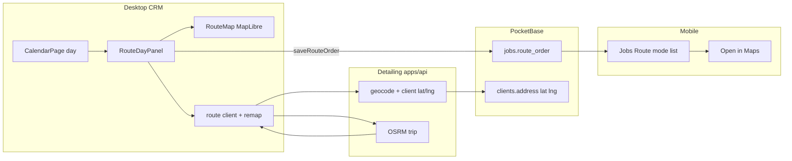
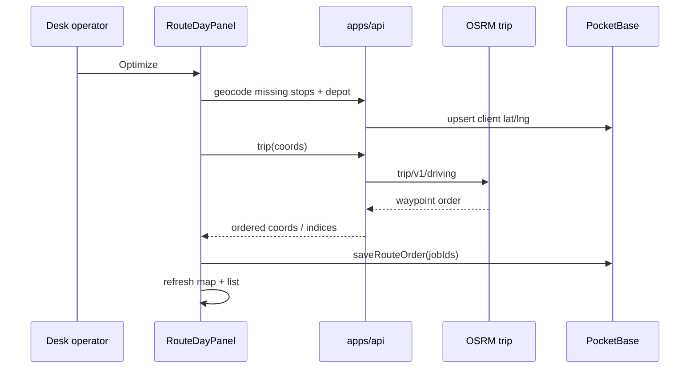

# Calendar Route Map - Plan

## Goal Capsule

**Objective.** Give Desk a Calendar-day Route panel with a beautiful custom MapLibre map (brand markers + polyline), drag reorder, and one-click OSRM trip optimize that writes shared PocketBase `route_order`. Keep mobile list-first with Open in Maps — no MapLibre on the phone.

**Product authority.** Product Contract from this `ce-plan` bootstrap; stack and surface decisions are session-settled (see Key Technical Decisions). Parity roadmap remains governing for shared-PB honesty.

**Open blockers.** None.

**Product Contract preservation.** N/A (ce-plan-bootstrap; no upstream requirements-only artifact).

**Sibling / target note.** Plan artifact lives in Desktop CRM. Implementation spans Desktop CRM (Desk UI) and Detailing monorepo (`apps/api`, PocketBase migrations, optional mobile touch). Paths below are repo-relative to their home; Detailing paths are prefixed `Detailing:`.

---

## Product Contract

### Summary

Sunday/day planning on Desk: open Calendar day → Route mode, see today’s mobile jobs on a branded map and ordered stop list, Optimize with OSRM, drag to fix, save `route_order`. Field techs keep today’s numbered list and hand off to Apple/Google Maps. Geocode results persist on clients so Desk and API stay honest.

### Problem Frame

Jobs already carry `route_order` and Desk already has `saveRouteOrder` / `sortJobsByRoute`, but nothing on Desk plans routes visually. Addresses are free text; there are no coordinates or map UI. Mobile owns manual reorder today. Competitors (Jobber-style) put multi-stop planning on office web and keep drivers on a thin stop list + Maps handoff.

### Actors

- A1. Owner / office operator on Desk (primary planner).
- A2. Field tech on mobile (consumes sequence; light ↑↓; Navigate).

### Requirements

- R1. Calendar **day** view exposes a **Route** mode/panel (not a new sidebar PageId in v1).
- R2. Panel lists that day’s mobile jobs sorted by `route_order` (nulls last), with `@dnd-kit` reorder that persists via `saveRouteOrder` (1-based).
- R3. Map uses **MapLibre** via `react-map-gl/maplibre` with a **custom style** and **handcrafted SVG/HTML stop markers** plus a **brand polyline** (rinse green) — no default teardrop / Google blue look.
- R4. **Optimize** geocodes depot (`business_address`) + stop addresses (via Detailing API), runs **OSRM trip**, remaps waypoint order to job IDs, persists with `saveRouteOrder`.
- R5. Geocode results are **cached on clients** (`lat`/`lng` + timestamp) so repeat Optimize/map loads do not thrash Nominatim.
- R6. Stops missing addresses (or failed geocode) stay on the list, are marked unplottable, and are excluded from Optimize matrix with a clear toast/banner.
- R7. Mobile remains **list-first**: Route mode ↑↓ + Open in Maps; **no MapLibre canvas** in v1.
- R8. Desk writeback stays compatible with mobile (`route_order` 1..n for the day’s ordered set).

### Key Decisions

- KD1. Surface = Calendar day Route panel (chosen over new Routes page for v1). `(session-settled: user-directed — chosen over dedicated Routes page / both-phased: matches Sunday planning on Calendar)`
- KD2. Map stack = MapLibre + custom graphics. `(session-settled: user-directed — chosen over Leaflet/Google defaults: beautiful custom basemap + markers)`
- KD3. Optimize v1 = OSRM trip; VROOM deferred. `(session-settled: user-directed — chosen over VROOM/Google Optim until multi-tech/time windows)`
- KD4. Mobile = shared order data, list + native Maps. `(session-settled: user-directed — chosen over embedding MapLibre on phone)`
- KD5. Geocode + trip live on Detailing `apps/api`. `(session-settled: user-directed — chosen over Desk-only browser/proxy: shared with mobile drive-time)`

### Acceptance Examples

- AE1. Day with 5 geocoded jobs → Optimize → stop order changes; mobile Jobs Route mode for that date shows the same order after refresh.
- AE2. Drag stop 3 above stop 1 → `route_order` updates; map marker numbers/polyline follow.
- AE3. Job without address → listed with “No address”; Optimize still runs on the rest; banner names the skipped jobs.
- AE4. Empty `business_address` → Optimize runs without depot (start/end unconstrained) or Warns and still optimizes stops-only (implementer picks one; document in UI).
- AE5. Mobile: Route mode list + Open in Maps unchanged; no new map screen.

### Scope Boundaries

**In scope**

- Desk Calendar Route panel + MapLibre map + OSRM Optimize
- Detailing API geocode + trip (+ PB client lat/lng)
- Minimal mobile verification / Maps handoff consistency

**Deferred for later**

- Dedicated Routes / Dispatch sidebar page
- VROOM / multi-tech / time windows / skill matching
- Live traffic, GPS tracking, customer ETA links
- Rewriting job `start_time` from drive legs
- Multi-day master routes
- Shop (`location_type`) vs mobile split optimization

**Outside this product’s identity**

- Minute-by-minute live dispatch twin of mobile
- Offline field queue on Desk

### Success Criteria

- Operator can plan a day’s stop order on Desk map without opening mobile.
- Mobile reads the same `route_order` without a MapLibre dependency.
- Map looks brand-owned (custom style + markers + green polyline).
- `pnpm build` passes on Desk; Detailing API tests cover geocode/trip remap helpers.

---

## Planning Contract

### Assumptions

- Detailing `apps/api` is reachable from Desk in the environments that matter (same pattern as future PDF/SMS waves); Desk gains a small typed client + env base URL.
- Nominatim + public/demo OSRM remain acceptable for early prod if rate-limited and cached; self-hosting OSRM is ops follow-up, not a v1 blocker.
- Day’s jobs = Desk jobs filtered by `anchorDate` (and mobile `location_type` / mobile jobs only if that filter already exists on Calendar — do not invent multi-tech filter in v1).
- Last-writer-wins on `route_order` between Desk and mobile is acceptable (parity pattern); no revision tokens in v1.

### Key Technical Decisions

- KTD1. **API home = Detailing `apps/api`.** Add geocode (reuse Nominatim pattern from `drive-time.ts`) and `POST` trip (OSRM `trip/v1/driving`). Persist coords on `clients`. `(session-settled: user-directed — chosen over Desk-browser OSRM)`
- KTD2. **Coords on `clients`** (`lat`, `lng`, `geocoded_at`) rather than a separate cache collection — enough for v1; invalidate/re-geocode when address text changes.
- KTD3. **Calendar rail modes:** extend the day right rail with modes `idle` | `jobDetail` | `blockDetail` | `route` (names flexible). Route and job detail share the rail — entering Route does not require a new PageId. Wider rail when map is shown.
- KTD4. **Map deps on Desk:** `maplibre-gl` + `react-map-gl` (maplibre entry). Style via `VITE_MAP_STYLE_URL` (and optional token). Brand polyline color from `src/theme/colors.ts` green `#22C55E`.
- KTD5. **Stop markers = React HTML/SVG overlays** (numbered badges), not default symbol layers alone — uniqueness and interaction (click → select job).
- KTD6. **DnD pattern = forms SortableFieldCard** (`@dnd-kit/sortable` vertical list), not SalesPipeline board — avoid filter-teleport class bugs (`docs/solutions/deals-board-teleport-fix.md`): Route list must include all jobs being reordered for that day.
- KTD7. **Optimize remapping:** OSRM trip returns waypoint order; map back to job IDs; call existing `saveRouteOrder`; then `setJobs` / refresh.
- KTD8. **Verification culture:** Desk has no unit-test runner today — add pure-helper tests where a runner exists (Detailing API Vitest) and Desk smoke via `pnpm build` + manual Calendar checklist. Optional: introduce Vitest on Desk only for `src/lib/route-*.ts` if implementer prefers colocated tests.

### High-Level Technical Design

### Alternative Approaches Considered

| Approach | Rejected because |
|----------|------------------|
| Leaflet + raster tiles | Harder brand uniqueness; settled MapLibre |
| Browser → public Nominatim/OSRM only | ToS/CORS/rate limits; no shared mobile path |
| VROOM in v1 | Overkill for ≤~10 stops/day; deferred by KD3 |
| New Routes PageId | Extra nav without proving Calendar panel first |
| MapLibre on mobile | Overwhelms field UX; conflicts with progressive disclosure |

### Risks & Dependencies

| Risk | Mitigation |
|------|------------|
| Geocode fails on street addresses | Banner + skip; keep free-text edit path on Contacts |
| Shared `route_order` races | Accept LWW; optional toast “Order saved” |
| Public OSRM flake | Cache coords; degrade Optimize with message; self-host later |
| Calendar rail vs job detail | Explicit Route mode toggle; closing Route restores prior mode |
| Tile/style cost/keys | Env-driven style URL; ship a free/public MapLibre style JSON for local/demo |
| Cross-repo Desk → API auth | Mirror existing mobile `appApiJson` auth/header pattern; document env |

### System-Wide Impact

- **Mobile** consumes Desk-written `route_order` immediately (shared PB).
- **Contacts / clients** gain geo fields; address edits should eventually invalidate coords (deferred exact timing).
- **Settings** Business Address becomes operationally load-bearing (depot).
- **Detailing API** becomes a Desk dependency for this feature (same eventual shape as PDF/SMS waves).

### Open Questions

- (deferred) When address changes on Desk Contacts, auto-clear `lat`/`lng` immediately vs lazy on next Optimize.
- (deferred) Empty depot: unconstrained trip vs require Settings address before Optimize enables — **default for implementer:** allow Optimize without depot; show quiet hint to set Business Address for better routes.
- (deferred) Whether Optimize should also preview leg minutes in the list (reuse drive-time) in the same PR.

---

## Implementation Units

### U1. Persist client coordinates (PocketBase)

**Goal.** Give geocode a durable home on `clients`.

**Requirements.** R5

**Dependencies.** None

**Files.**
- `Detailing:apps/pocketbase/pb_migrations/` (new migration)
- Optionally refresh schema dump if the repo maintains one
- `Detailing:packages/core` client types / zod if coords are validated there
- Desktop CRM: `src/lib/types.ts` (`DeskClient` lat/lng optional)

**Approach.**
1. Add optional number fields `lat`, `lng`, and optional datetime/text `geocoded_at` on `clients`.
2. Mirror optional fields on Desk `DeskClient` + `mapClient` in `src/lib/api.ts`.
3. Do not geocode in this unit.

**Patterns to follow.** `Detailing:apps/pocketbase/pb_migrations/1763010000_wave5_job_fields.js` style for `route_order`.

**Test scenarios.**
- Migration applies on clean PB; existing clients remain readable with null coords.
- Desk type mapping tolerates missing fields (undefined).

**Verification.** Migration runs; Desk types compile.

---

### U2. Detailing API — geocode + OSRM trip

**Goal.** Server endpoints Desk (and later mobile) call for coordinates and optimized waypoint order.

**Requirements.** R4, R5, R6

**Dependencies.** U1

**Files.**
- `Detailing:apps/api/src/lib/server/drive-time.ts` (reuse Nominatim helper; extract shared geocode if clean)
- `Detailing:apps/api/src/app/api/drive-time/route.ts` (reference only)
- New: `Detailing:apps/api/src/app/api/geocode/route.ts` (or combined route-ops module)
- New: `Detailing:apps/api/src/app/api/route-trip/route.ts` (name flexible)
- New helpers + `*.test.ts` under `Detailing:apps/api/src/lib/`
- `Detailing:apps/api/src/lib/maps-url.ts` (optional: ensure multi-stop URL helper stays available for mobile)

**Approach.**
1. Geocode address → `{lat,lng}`; if `client_id` provided and success, write `lat`/`lng`/`geocoded_at` when address matches stored text (or always overwrite from request address).
2. Trip: accept ordered list of `{id, lat, lng}` (+ optional depot); call OSRM `trip/v1/driving/{lon},{lat};...` with `source=first` / `destination=last` when depot fixed; return remapped id order + geometry summary if cheap.
3. Rate-limit / cache headers as appropriate; reuse User-Agent discipline from drive-time.
4. Fail soft: 4xx with which ids failed.

**Patterns to follow.** Existing `drive-time.ts` Nominatim + OSRM fetch style.

**Execution note.** Start with Vitest covering waypoint index → id remap and empty/partial input.

**Test scenarios.**
- Happy: 3 waypoints → permutation returned; ids stable.
- Depot first/last constraints honored when provided.
- Geocode miss → null coords / error payload; no crash.
- Identical origin/destination short-circuit like drive-time.
- OSRM non-Ok → API error, no partial silent success.

**Verification.** Vitest green; manual curl against local API with known coords.

---

### U3. Desk route client + remap helpers

**Goal.** Typed Desk access to API + pure remap used by Optimize.

**Requirements.** R4, R8

**Dependencies.** U2

**Files.**
- New: `src/lib/route-api.ts` (or similar)
- New: `src/lib/route-optimize.ts` (pure remap / day-job filter helpers)
- `src/vite-env.d.ts` — `VITE_APP_API_URL` (or reuse existing if present), `VITE_MAP_STYLE_URL`, optional token
- Possibly `.env.example` if the repo uses one

**Approach.**
1. Thin fetch wrapper to geocode and trip endpoints (auth headers consistent with how Desk will call Detailing API — follow mobile `appApiJson` contract as documented in Detailing).
2. Pure functions: filter jobs by date; pair with client address/coords; apply trip index order → `jobId[]`.
3. Call existing `saveRouteOrder` from `src/lib/api.ts`; use `sortJobsByRoute` from `src/lib/metrics.ts`.

**Patterns to follow.** `src/lib/api.ts` error handling; settings load for `business_address`.

**Test scenarios.**
- Remap: trip order `[2,0,1]` on ids `a,b,c` → `c,a,b`.
- Jobs without coords excluded from trip payload but preserved in full day list order after numbered stops.
- `sortJobsByRoute` still nulls-last after save.

**Verification.** Pure tests if Vitest added on Desk; otherwise cover remap in Detailing tests with shared fixture comments + Desk build.

---

### U4. RouteMap — MapLibre + custom graphics

**Goal.** Beautiful branded map for plotted stops.

**Requirements.** R3

**Dependencies.** U3 (coords in props; can stub with fixtures first)

**Files.**
- New: `src/components/calendar/RouteMap.tsx`
- New: `src/components/calendar/RouteStopMarker.tsx` (SVG/HTML badge)
- Optional: `src/components/calendar/routeMapStyle.ts` or static `public/map-style.json`
- `package.json` — add `maplibre-gl`, `react-map-gl`
- `src/theme/colors.ts` (consume existing green)
- `src/index.css` — import MapLibre CSS if required

**Approach.**
1. `react-map-gl/maplibre` Map with env style URL; fit bounds to depot + stops.
2. HTML markers: numbered rinse badges; selected state; click selects job.
3. GeoJSON line layer or SVG overlay for optimized/current order polyline in brand green — not Google-blue defaults.
4. Depot marker distinct (home/shop glyph) when `business_address` geocoded.
5. Empty/error states: no tokens, zero plottable stops.

**Patterns to follow.** Brand tokens; soft, desk-native chrome (avoid purple glow / generic AI map skins). Frontend design rules: map is the interactive canvas — not a decorative card collage inside the rail.

**Test expectation:** none for pure styling — smoke visual on day with ≥2 stops.

**Verification.** Map renders in Calendar Route mode; markers numbered; polyline follows list order.

---

### U5. RouteDayPanel + Calendar integration

**Goal.** Day Route UX: list + map + Optimize + persist.

**Requirements.** R1, R2, R4, R6, R8

**Dependencies.** U3, U4

**Files.**
- New: `src/components/calendar/RouteDayPanel.tsx`
- Modify: `src/pages/CalendarPage.tsx`
- Reuse: `src/components/automations/PanelEdgeToggle.tsx`
- DnD patterns: `src/components/forms/FormCanvas.tsx` / `SortableFieldCard.tsx`
- `src/providers/DataProvider.tsx` — `setJobs` after save
- `src/lib/settings-api.ts` — read `business_address`

**Approach.**
1. Day view control: “Route” toggles rail into route mode (wider if needed).
2. Left/list: sortable stops (client name, time, address snippet, unplottable badge).
3. Map beside/above list.
4. Actions: Optimize (loading/error), Save implied on drag end + Optimize success.
5. On drag end → `saveRouteOrder` → update local jobs.
6. Keep job-detail panel reachable (select stop → optional detail, or exit Route).

**Patterns to follow.** Calendar GCal panel plan: visible rail = actionable; `docs/solutions/deals-board-teleport-fix.md` — do not filter the sortable list so dragged items disappear.

**Execution note.** Manual smoke first; no Red/Green ceremony required beyond API unit tests.

**Test scenarios.**
- Happy: reorder two jobs → PB `route_order` 1..n; list and map numbers match.
- Optimize success → new order persisted; toast/quiet success.
- Optimize with 1 plottable stop → no-op or disabled button with reason.
- Unplottable jobs remain listed and do not break Optimize.
- Switching away from Route mode does not leave orphan drafts (order already persisted).

**Verification.** AE1–AE4 manual checklist; `pnpm build`.

---

### U6. Mobile compatibility (minimal)

**Goal.** Confirm shared `route_order` + Maps handoff without adding MapLibre.

**Requirements.** R7, R8

**Dependencies.** U1–U5 for end-to-end; can smoke in parallel once Desk writes orders

**Files.**
- `Detailing:apps/mobile-wave5-crm/app/(tabs)/jobs/index.tsx` (Route mode — verify only unless bug)
- `Detailing:apps/mobile-wave5-crm/src/lib/jobs-list-logic.ts`
- `Detailing:apps/mobile-wave5-crm/src/lib/api.ts` `openMaps`
- Optional small polish: prefer `maps-url` helper if single-address open is weaker than desired — **no new map screen**

**Approach.**
1. Manual: Desk Optimize → pull-to-refresh / reopen Jobs on date → order matches.
2. Open in Maps still works per stop.
3. Fix only if Desk writes incompatible null/zero orders.

**Test scenarios.**
- Covers AE1 / AE5: mobile list order matches Desk after Optimize.
- Mobile ↑↓ still persists and Desk sees update after refresh.

**Verification.** Device or simulator smoke; no MapLibre dependency added to mobile `package.json`.

---

### U7. Env, settings honesty, operator docs note

**Goal.** Make the feature discoverable and configurable.

**Requirements.** R1, R4

**Dependencies.** U5

**Files.**
- `src/vite-env.d.ts`, env examples
- `src/pages/SettingsPage.tsx` / `src/lib/settings-hub.ts` — clarify that Business Address is the route depot (copy only)
- Optional: short note in `docs/plans/` done section or AGENTS.md only if the team already documents features there — prefer Settings helper text over new markdown sprawl

**Approach.**
1. Document required env vars in plan Verification + Settings helper under Business Address (“Used as route start/end on Calendar Route”).
2. Disable or warn Optimize when style URL missing (map empty state).

**Test expectation:** none — config/copy.

**Verification.** Fresh env with style URL shows basemap; missing URL shows actionable empty state.

---

## Verification Contract

**Automated**
- Detailing API: Vitest for geocode/trip remap helpers (`Detailing:apps/api`).
- Desk: `pnpm build` (TypeScript + Vite).

**Manual smoke**
1. Set `business_address` and Map style env; open Calendar → day with ≥3 jobs with addresses.
2. Enter Route → markers + list order appear.
3. Optimize → order changes on Desk; refresh mobile Route mode → same order.
4. Drag reorder → persists; polyline/numbers update.
5. Remove address from one client → unplottable badge; Optimize skips it.
6. Confirm mobile has no new map dependency.

**Quality gates**
- Shared PB honesty: no Desk-only fork of `route_order`.
- Visual: custom markers + brand polyline (not default Google styling).

---

## Definition of Done

- All U1–U7 complete or explicitly waived with reason.
- AE1–AE5 pass.
- No MapLibre on mobile.
- Product Contract R1–R8 satisfied.
- Plan KTDs not silently reversed.

---

## Appendix

### Sources & Research (load-bearing)

- Parallel web research: MapLibre preferred for custom WebGL styles (`route-map-libs-graphics.json`); Jobber/ServiceTitan desk-vs-mobile split (`route-web-mobile-ux.json`); OSRM trip for TSP (`route-optimizer-map-crm.json`).
- Institutional: Sunday planning + sparse writeback (`docs/research/desk-ops-reviewer-analytics-2026.json`); Calendar right-rail patterns (`docs/plans/2026-08-01-001-feat-calendar-gcal-panel-plan.md`); DnD filter teleport (`docs/solutions/deals-board-teleport-fix.md`).
- Code hooks: `src/lib/api.ts` `saveRouteOrder`; `src/lib/metrics.ts` `sortJobsByRoute`; mobile Route mode `Detailing:apps/mobile-wave5-crm/app/(tabs)/jobs/index.tsx`; drive-time `Detailing:apps/api/src/lib/server/drive-time.ts`.

### Existing hooks (Desk)

- `saveRouteOrder` / `sortJobsByRoute` — wire UI; do not redesign semantics.
- `@dnd-kit` already installed.
- No map libraries in Desk `package.json` yet.
